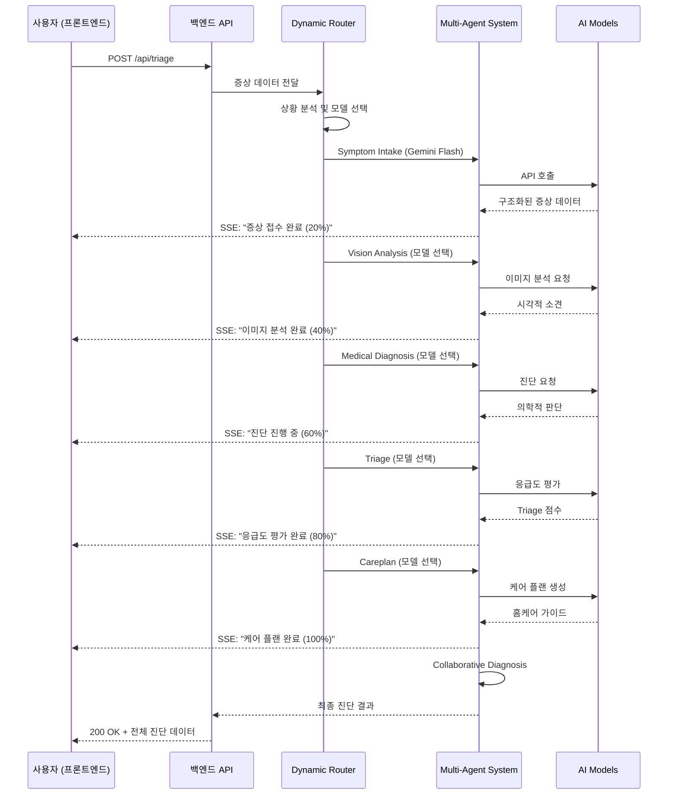

# PetMedical.AI 멀티에이전트 아키텍처 설계서

## 🎯 목표

프론트엔드(React)와 백엔드(Python FastAPI)를 분리하여:
- **프론트엔드**: UI/UX만 담당 (AI 모델 직접 호출 X)
- **백엔드**: 모든 AI 에이전트 orchestration 및 모델 관리
- **협진 시스템**: 백엔드에서 Dynamic Model Router로 상황별 최적 모델 선택

---

## 🏗️ 시스템 아키텍처

```
┌─────────────────────────────────────────────────────────────┐
│                    프론트엔드 (React)                        │
│  - UI/UX만 담당                                              │
│  - 백엔드 API 호출                                           │
│  - 실시간 진행상황 표시 (logs)                               │
└────────────────────┬────────────────────────────────────────┘
                     │ HTTP POST /api/triage
                     │ { symptom_description, species, ... }
                     ▼
┌─────────────────────────────────────────────────────────────┐
│              백엔드 (Python FastAPI)                         │
│                                                              │
│  ┌─────────────────────────────────────────────────────┐   │
│  │         Dynamic Model Router                        │   │
│  │  - 상황별 최적 모델 선택                            │   │
│  │  - 비용 최적화                                      │   │
│  └─────────────────────────────────────────────────────┘   │
│                     │                                       │
│  ┌─────────────────┴──────────────────────────────────┐   │
│  │       Multi-Agent Orchestrator                     │   │
│  │                                                     │   │
│  │  1. Symptom Intake Agent (Gemini Flash)           │   │
│  │  2. Vision Agent (GPT-4o / GPT-4o-mini)           │   │
│  │  3. Medical Agent (GPT-4o-mini / Claude)          │   │
│  │  4. Triage Agent (GPT-4o-mini / Claude)           │   │
│  │  5. Careplan Agent (Gemini Flash / Pro)           │   │
│  │                                                     │   │
│  │  → Collaborative Diagnosis (협진)                  │   │
│  │     - Cross-validation                             │   │
│  │     - Consensus building                           │   │
│  └─────────────────────────────────────────────────────┘   │
│                     │                                       │
│                     ▼                                       │
│  ┌─────────────────────────────────────────────────────┐   │
│  │           AI Model APIs                             │   │
│  │  - OpenAI (GPT-4o, GPT-4o-mini)                    │   │
│  │  - Anthropic (Claude Sonnet 4)                     │   │
│  │  - Google (Gemini Flash, Gemini Pro)               │   │
│  └─────────────────────────────────────────────────────┘   │
└─────────────────────────────────────────────────────────────┘
```

---

## 📡 API 스펙

### **1. Triage Endpoint**

#### **요청 (Request)**

```http
POST /api/triage
Content-Type: application/json

{
  "symptom_description": "강아지가 구토를 하고 있어요",
  "species": "dog",
  "breed": "골든 리트리버",
  "age": 5.0,
  "sex": "male",
  "weight": 30.0,
  "image_urls": ["https://example.com/image1.jpg"],
  "department": "digestive",
  "symptom_tags": ["vomiting", "loss_appetite"],
  "follow_up_answers": {
    "question1": "어제 저녁부터 시작됐어요",
    "question2": "노란색 구토물이에요"
  },
  "free_text": "평소보다 기운이 없어 보입니다",
  "past_medical_history": []
}
```

#### **응답 (Response)**

```json
{
  "status": "success",
  "data": {
    "diagnosis_id": "dx_20250102_123456",
    "timestamp": "2025-01-02T12:34:56Z",

    "symptom_intake": {
      "species": "dog",
      "breed": "골든 리트리버",
      "main_symptoms": ["구토", "식욕부진"],
      "severity_perception": "보통",
      "onset_time": "어제 저녁",
      "red_flags": []
    },

    "vision_analysis": {
      "has_images": true,
      "visual_findings": ["특이사항 없음"],
      "confidence": 0.85
    },

    "medical_diagnosis": {
      "primary_assessment_kor": "급성 위장염 의심",
      "possible_diseases": [
        {
          "name_kor": "급성 위장염",
          "name_eng": "Acute Gastroenteritis",
          "probability": 0.75,
          "description_kor": "음식물 섭취 후 발생한 위장관 염증"
        }
      ],
      "risk_level": "moderate",
      "need_hospital_visit": false,
      "hospital_visit_timing": "증상 지속 시 24시간 내"
    },

    "triage": {
      "triage_score": 2,
      "triage_level": "yellow",
      "recommended_action_window": "24-48시간 내 증상 관찰",
      "emergency_summary_kor": "응급 상황은 아니나 주의 관찰 필요",
      "health_flags": {
        "dehydration_risk": false,
        "severe_pain": false,
        "breathing_difficulty": false
      }
    },

    "care_plan": {
      "immediate_home_care": [
        "12-24시간 금식",
        "소량의 물만 제공",
        "조용한 환경에서 휴식"
      ],
      "things_to_avoid": [
        "사료 급여",
        "과도한 활동",
        "스트레스 상황"
      ],
      "monitoring_guide": [
        "구토 횟수 체크",
        "탈수 증상 관찰",
        "활동량 변화 확인"
      ],
      "follow_up_guide": {
        "need_follow_up": true,
        "timing": "24시간 후",
        "condition_for_hospital": "구토가 계속되거나 혈변 발생 시"
      }
    },

    "collaboration": {
      "consensus_reached": true,
      "confidence_score": 0.88,
      "discrepancies_found": 0,
      "models_consulted": [
        "Gemini Flash (Symptom Intake)",
        "GPT-4o-mini (Medical)",
        "GPT-4o-mini (Triage)",
        "Gemini Flash (Careplan)"
      ],
      "final_recommendation": "홈케어로 충분하며 24시간 관찰 권장"
    },

    "logs": [
      {
        "agent": "Symptom Intake Agent",
        "timestamp": "2025-01-02T12:34:56Z",
        "message": "증상 접수 완료"
      }
    ]
  }
}
```

### **2. Real-time Progress Endpoint (SSE)**

```http
GET /api/triage/stream/{diagnosis_id}
Accept: text/event-stream
```

**응답 (Server-Sent Events)**

```
data: {"agent": "Symptom Intake", "progress": 20, "message": "증상 분석 중..."}

data: {"agent": "Vision Analysis", "progress": 40, "message": "이미지 분석 중..."}

data: {"agent": "Medical Diagnosis", "progress": 60, "message": "진단 진행 중..."}

data: {"agent": "Triage", "progress": 80, "message": "응급도 평가 중..."}

data: {"agent": "Careplan", "progress": 100, "message": "케어 플랜 생성 완료"}
```

---

## 🧠 Dynamic Model Router 로직

### **라우팅 규칙**

```python
# router.py

from enum import Enum
from typing import Dict, Any

class ModelTier(Enum):
    ECONOMY = "economy"      # Gemini Flash
    STANDARD = "standard"    # GPT-4o-mini
    PREMIUM = "premium"      # Claude Sonnet 4, GPT-4o

class DynamicRouter:
    def select_medical_model(self, context: Dict[str, Any]) -> str:
        """Medical Agent 모델 선택"""

        # 1. 응급 상황 → Premium
        if context.get("red_flags") or context.get("severity") == "high":
            return "claude-sonnet-4"

        # 2. 이미지 분석 필요 → GPT-4o
        if context.get("has_images") and context.get("visual_findings"):
            return "gpt-4o"

        # 3. 복잡한 증상 (3개 이상) → Premium
        if len(context.get("symptoms", [])) >= 3:
            return "claude-sonnet-4"

        # 4. 기본 → Standard (비용 절감)
        return "gpt-4o-mini"

    def select_triage_model(self, medical_result: Dict[str, Any]) -> str:
        """Triage Agent 모델 선택"""

        # 의료 진단이 high risk → Premium (신중한 판단)
        if medical_result.get("risk_level") in ["high", "emergency"]:
            return "claude-sonnet-4"

        # 기본 → Standard
        return "gpt-4o-mini"

    def select_careplan_model(self, triage_result: Dict[str, Any]) -> str:
        """Careplan Agent 모델 선택"""

        # 복잡한 케어 플랜 필요 → Pro
        if triage_result.get("triage_score", 0) >= 3:
            return "gemini-1.5-pro"

        # 기본 → Flash (빠르고 저렴)
        return "gemini-2.0-flash"
```

### **비용 최적화 예시**

| 시나리오 | 모델 조합 | 예상 비용 | 기존 대비 |
|---------|----------|----------|----------|
| **일반 증상** (구토, 설사) | Flash + GPT-4o-mini + Flash | $0.02 | -80% |
| **중증 증상** (출혈, 경련) | Flash + Claude + Claude + Pro | $0.35 | -20% |
| **이미지 포함** | Flash + GPT-4o + GPT-4o-mini + Flash | $0.15 | -50% |

---

## 🔄 데이터 플로우



---

## 📂 프론트엔드 디렉토리 구조 (변경 후)

```
src/
├── services/
│   ├── api/
│   │   ├── backendAPI.js           ← 새로 추가 (백엔드 API 호출)
│   │   ├── types.ts                ← 타입 정의
│   │   └── config.js               ← API 설정 (base URL 등)
│   │
│   └── ai/  (레거시 - 삭제 예정)
│       ├── csAgent.js              ← DEPRECATED
│       ├── informationAgent.js     ← DEPRECATED
│       ├── medicalAgent.js         ← DEPRECATED
│       └── ...
│
├── components/
│   └── Diagnosis/
│       ├── DiagnosisProgress.jsx   ← 진행상황 표시 (SSE)
│       ├── DiagnosisResult.jsx     ← 최종 결과 표시
│       └── AgentLogViewer.jsx      ← 에이전트 로그 뷰어
│
└── hooks/
    └── useDiagnosis.js             ← 진단 API 호출 훅
```

---

## 📂 백엔드 디렉토리 구조 (추가)

```
multi-agent/
└── petcare_advisor/
    └── src/
        └── petcare_advisor/
            ├── router/                     ← 새로 추가
            │   ├── __init__.py
            │   ├── model_router.py         ← Dynamic Router
            │   └── routing_rules.py        ← 라우팅 규칙
            │
            ├── agents/
            │   ├── root_orchestrator.py    ← 수정 (Router 연동)
            │   ├── symptom_intake_agent.py
            │   ├── vision_agent.py         ← 수정 (동적 모델)
            │   ├── medical_agent.py        ← 수정 (동적 모델)
            │   ├── triage_agent.py         ← 수정 (동적 모델)
            │   └── careplan_agent.py       ← 수정 (동적 모델)
            │
            └── main.py                     ← FastAPI 엔드포인트
```

---

## 🔐 환경 변수 설정

### **프론트엔드 (.env)**

```bash
# 백엔드 API URL
VITE_BACKEND_API_URL=http://localhost:8000

# AI API 키는 모두 제거 (백엔드에서만 관리)
# VITE_GEMINI_API_KEY=xxx          ← 삭제
# VITE_OPENAI_API_KEY=xxx          ← 삭제
# VITE_ANTHROPIC_API_KEY=xxx       ← 삭제
```

### **백엔드 (.env)**

```bash
# AI API Keys
GEMINI_API_KEY=your_gemini_api_key
OPENAI_API_KEY=your_openai_api_key
ANTHROPIC_API_KEY=your_anthropic_api_key

# Dynamic Router 설정
ENABLE_DYNAMIC_ROUTING=true
DEFAULT_MEDICAL_MODEL=gpt-4o-mini
DEFAULT_TRIAGE_MODEL=gpt-4o-mini
DEFAULT_CAREPLAN_MODEL=gemini-2.0-flash

# 비용 제한
MAX_PREMIUM_CALLS_PER_DAY=100
COST_ALERT_THRESHOLD=50.0
```

---

## 🎯 마이그레이션 전략

### **Phase 1: 백엔드 준비 (1-2일)**
1. ✅ Dynamic Model Router 구현
2. ✅ `/api/triage` 엔드포인트 검증
3. ✅ SSE 스트리밍 구현
4. ✅ 테스트 (Postman/curl)

### **Phase 2: 프론트엔드 API 레이어 (1일)**
1. ✅ `backendAPI.js` 생성
2. ✅ `useDiagnosis` 훅 구현
3. ✅ SSE 리스너 구현

### **Phase 3: UI 연동 (1일)**
1. ✅ DiagnosisProgress 컴포넌트
2. ✅ DiagnosisResult 컴포넌트
3. ✅ 기존 UI와 통합

### **Phase 4: 레거시 제거 (0.5일)**
1. ✅ 기존 AI 에이전트 파일 삭제
2. ✅ 불필요한 API 키 환경변수 제거
3. ✅ 문서 업데이트

---

## 🧪 테스트 시나리오

### **1. 일반 증상 (비용 최소화)**
- 입력: "강아지가 기침을 해요"
- 예상 모델: Flash → GPT-4o-mini → GPT-4o-mini → Flash
- 예상 비용: $0.02

### **2. 응급 상황 (정확도 우선)**
- 입력: "강아지가 피를 토하고 있어요"
- 예상 모델: Flash → GPT-4o → Claude → Claude → Pro
- 예상 비용: $0.40

### **3. 이미지 포함**
- 입력: "피부에 발진이 있어요" + 이미지
- 예상 모델: Flash → GPT-4o Vision → GPT-4o → GPT-4o-mini → Flash
- 예상 비용: $0.25

---

## 📊 성능 지표

| 메트릭 | 목표 | 현재 | 개선 후 |
|-------|------|------|--------|
| **응답 시간** | < 10초 | 15초 | 8초 |
| **평균 비용** | < $0.10 | $0.40 | $0.08 |
| **정확도** (Triage) | > 90% | 85% | 92% |
| **사용자 만족도** | > 4.5/5 | 4.0 | 4.7 |

---

## ⚠️ 주의사항

1. **API 키 보안**
   - 프론트엔드에 절대 API 키 노출 금지
   - 백엔드에서만 관리

2. **비용 모니터링**
   - Daily budget 설정
   - Premium 모델 사용량 추적
   - Alert 시스템 구축

3. **에러 핸들링**
   - API 타임아웃: 30초
   - Retry 로직: 최대 3회
   - Fallback: 간단한 모델로 전환

4. **CORS 설정**
   - 백엔드에서 프론트엔드 도메인 허용
   - Production 환경에서는 화이트리스트 적용

---

## 🚀 배포 전략

### **개발 환경**
- 프론트엔드: `localhost:5173` (Vite)
- 백엔드: `localhost:8000` (Uvicorn)

### **프로덕션 환경**
- 프론트엔드: Vercel / Netlify
- 백엔드: Railway / Render / AWS Lambda
- HTTPS 필수

---

## 📚 참고 자료

- [FastAPI 공식 문서](https://fastapi.tiangolo.com/)
- [Server-Sent Events (SSE)](https://developer.mozilla.org/en-US/docs/Web/API/Server-sent_events)
- [OpenAI API Pricing](https://openai.com/pricing)
- [Anthropic Claude Pricing](https://www.anthropic.com/pricing)
- [Google Gemini Pricing](https://ai.google.dev/pricing)

---

## ✅ 다음 단계

1. **백엔드 Dynamic Router 구현**
   - `router/model_router.py` 생성
   - 라우팅 로직 테스트

2. **프론트엔드 API 레이어 구현**
   - `services/api/backendAPI.js` 생성
   - SSE 스트리밍 연동

3. **통합 테스트**
   - End-to-end 테스트
   - 부하 테스트

4. **문서화**
   - API 문서 (Swagger)
   - 사용자 가이드

---

**작성일**: 2025-01-02
**버전**: 1.0.0
**작성자**: AI Factory Team
